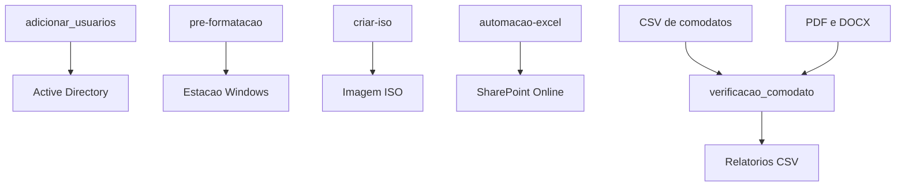

# Windows Troubleshooting

Coleção de scripts para automação administrativa em ambientes Windows corporativos. O repositório reúne rotinas de Active Directory, preparação de estações, criação de mídia ISO, SharePoint Online e conferência de ativos e documentos.

## Visão geral

Este não é um sistema web tradicional. Não há frontend, backend HTTP, banco de dados, testes automatizados ou pipeline CI/CD. Cada pasta contém uma automação independente, normalmente formada por um script principal e sua documentação.

## Estrutura do repositório

```text
.
├── adicionar_usuarios/
│   ├── adicionarusuario.ps1  # Cria OUs e usuário no Active Directory
│   └── README.md             # Documentação do provisionamento AD
├── automacao-excel/
│   ├── script.ps1            # Cria pastas no SharePoint a partir de CSV
│   ├── modelo_exemplo.csv    # Modelo de entrada, atualmente vazio
│   └── README.md             # Documentação da automação SharePoint
├── criar-iso/
│   └── criariso.ps1          # Gera uma imagem ISO usando IMAPI2
├── pre-formatacao/
│   ├── Setup.ps1             # Configura estação Windows e ingresso no domínio
│   └── README.md             # Documentação da preparação OOBE
├── verificacao_comodato/
│   ├── verificar_comodatos.py # Confere ativos em PDFs
│   └── verificar_docx.py      # Confere ativos em documentos DOCX
└── README.md
```

## Componentes

### Active Directory

O [adicionarusuario.ps1](adicionar_usuarios/adicionarusuario.ps1) detecta o domínio atual, cria a OU `HRBR` com OUs departamentais e cria o usuário `tiago.oliveira` na OU de TI. A senha é solicitada durante a execução com `SecureString` e a troca no primeiro logon é obrigatória.

Requer o módulo PowerShell `ActiveDirectory` e permissões para criar OUs e usuários.

### Preparação de estações

O [Setup.ps1](pre-formatacao/Setup.ps1) automatiza a preparação de uma estação Windows. Ele:

- solicita o hostname;
- verifica conectividade com o domínio;
- cria ou atualiza uma conta local de suporte;
- configura administradores locais;
- agenda permissões de usuários do domínio após o reboot;
- ingressa a máquina no Active Directory;
- renomeia o computador;
- altera o fluxo do OOBE;
- reinicia a máquina.

O script exige PowerShell elevado e credenciais autorizadas para ingressar computadores no domínio. As operações de Registro, grupos administrativos e OOBE devem ser testadas em uma máquina virtual antes do uso em produção.

### Criação de ISO

O [criariso.ps1](criar-iso/criariso.ps1) usa o componente COM `IMAPI2FS.MsftFileSystemImage` para gerar uma ISO a partir de `C:\temp\pre-formatacao` e salvá-la em `C:\temp\script.iso`.

Os caminhos são absolutos e precisam existir na máquina de execução. A pasta não possui README próprio.

### SharePoint Online

O [script.ps1](automacao-excel/script.ps1) usa `PnP.PowerShell` para ler um CSV e criar pastas em uma biblioteca do SharePoint Online. Ele possui:

- modo de simulação com `$DryRun`;
- proteção contra duplicidades no CSV;
- verificação de pastas já existentes;
- sanitização de caracteres inválidos;
- logs com contadores de sucesso, duplicidade e erro;
- tratamento individual de falhas por registro.

Requer PowerShell e o módulo `PnP.PowerShell`. Apesar do nome da pasta, a implementação atual lê CSV diretamente. O formato de colunas descrito no README da pasta deve ser alinhado às colunas realmente procuradas pelo script, incluindo `CPF`.

### Conferência de comodatos

Os scripts da pasta [verificacao_comodato](verificacao_comodato) usam Python para cruzar dados de equipamentos com documentos.

O [verificar_comodatos.py](verificacao_comodato/verificar_comodatos.py):

1. lê `VerificarComodatos.csv`;
2. percorre PDFs recursivamente;
3. extrai texto com `pypdf`;
4. localiza patrimônio e número de série;
5. detecta padrões de processadores Intel;
6. compara os dados e gera `Resultado_Comodatos_Verificados.csv`.

O [verificar_docx.py](verificacao_comodato/verificar_docx.py) filtra itens não localizados em PDF, percorre DOCX com `python-docx` e gera `Resultado_Comodatos_DOCX.csv`. Os scripts não se chamam diretamente; o encadeamento depende da preparação dos arquivos e colunas de entrada.

## Fluxo arquitetural



Não existe um ponto de entrada único nem chamadas diretas entre as pastas. A relação entre `criar-iso` e `pre-formatacao` é operacional: a ISO pode empacotar arquivos da preparação, mas o script usa caminho absoluto externo ao repositório.

## Tecnologias e dependências

| Área | Tecnologias |
| --- | --- |
| Administração Windows | PowerShell, Registro, OOBE, grupos locais |
| Identidade | Active Directory, OUs, usuários e domínio |
| Cloud | SharePoint Online, PnP.PowerShell |
| Documentos | Python, pandas, pypdf, python-docx |
| Mídia | COM IMAPI2FS, C#, interoperabilidade COM |
| Dados | CSV, texto extraído de PDF e DOCX |

As dependências Python não estão declaradas em `requirements.txt` ou `pyproject.toml`. Também não há manifesto de módulos PowerShell.

## Relação com carreiras

| Objetivo | Partes mais importantes | Conhecimentos envolvidos | Prioridade |
| --- | --- | --- | --- |
| Backend | `automacao-excel`, `verificacao_comodato` | Processamento, validação, integração e relatórios | Média |
| Frontend | Não há implementação | Interface CLI ou futura interface web | Baixa |
| Full Stack | SharePoint e processamento de comodatos | Dados, integração, APIs e apresentação | Baixa |
| Infraestrutura | `pre-formatacao`, `criar-iso` | Windows, AD, Registro, OOBE e imagens | Alta |
| DevOps | `automacao-excel`, `pre-formatacao` | Automação, idempotência, logs e execução controlada | Média |
| Cloud | `automacao-excel` | SharePoint Online, PnP e permissões | Alta |
| SRE | Logs e contadores do SharePoint | Observabilidade, métricas e tratamento de falhas | Baixa |
| Cybersecurity | `pre-formatacao`, `adicionar_usuarios` | Privilégios, credenciais, AD, LAPS e GPO | Alta |
| QA/Testes | Todos os scripts | Testes de PowerShell/Python e dados de entrada | Média |
| Data/Database | `verificacao_comodato` | pandas, regex, documentos e CSV | Alta |

## O que estudar primeiro

- **Infraestrutura e SysAdmin:** comece por [pre-formatacao/Setup.ps1](pre-formatacao/Setup.ps1) e depois estude [adicionar_usuarios/adicionarusuario.ps1](adicionar_usuarios/adicionarusuario.ps1). Eles concentram domínio, máquinas, usuários, grupos e políticas operacionais.
- **DevOps:** comece por [automacao-excel/script.ps1](automacao-excel/script.ps1), observando `DryRun`, logs, tratamento de exceções e controle de duplicidade.
- **Cloud:** estude a integração com SharePoint e o módulo `PnP.PowerShell` no mesmo script.
- **Cybersecurity:** analise as operações privilegiadas de `Setup.ps1`, especialmente conta local, administradores, `RunOnce`, credenciais e alterações do OOBE.
- **QA/Testes:** use os scripts de comodatos para criar casos de teste com PDFs, DOCX e CSVs válidos, ausentes, duplicados e inconsistentes.
- **Data:** comece por [verificacao_comodato/verificar_comodatos.py](verificacao_comodato/verificar_comodatos.py), seguindo o fluxo de ingestão, extração, comparação e exportação.
- **Frontend:** não há uma base existente; seria necessário criar uma interface para executar as rotinas e visualizar logs e relatórios.

## Limitações conhecidas

- Não há testes automatizados ou validação em CI.
- Não há dependências fixadas para Python ou PowerShell.
- Não há banco de dados persistente.
- Não há pipeline de execução único.
- `criariso.ps1` utiliza caminhos absolutos.
- Os scripts de comodatos dependem de arquivos de entrada externos.
- O modelo CSV está vazio.
- Não há `.gitignore` no repositório atual; arquivos reais de funcionários, documentos, logs e relatórios não devem ser publicados.

## Segurança

As senhas não devem ser armazenadas nos scripts. Os scripts atuais solicitam credenciais durante a execução, mas ainda realizam operações privilegiadas. Em ambiente real, recomenda-se utilizar Microsoft LAPS, GPO, gestão centralizada de privilégios, auditoria e armazenamento seguro de dados.
